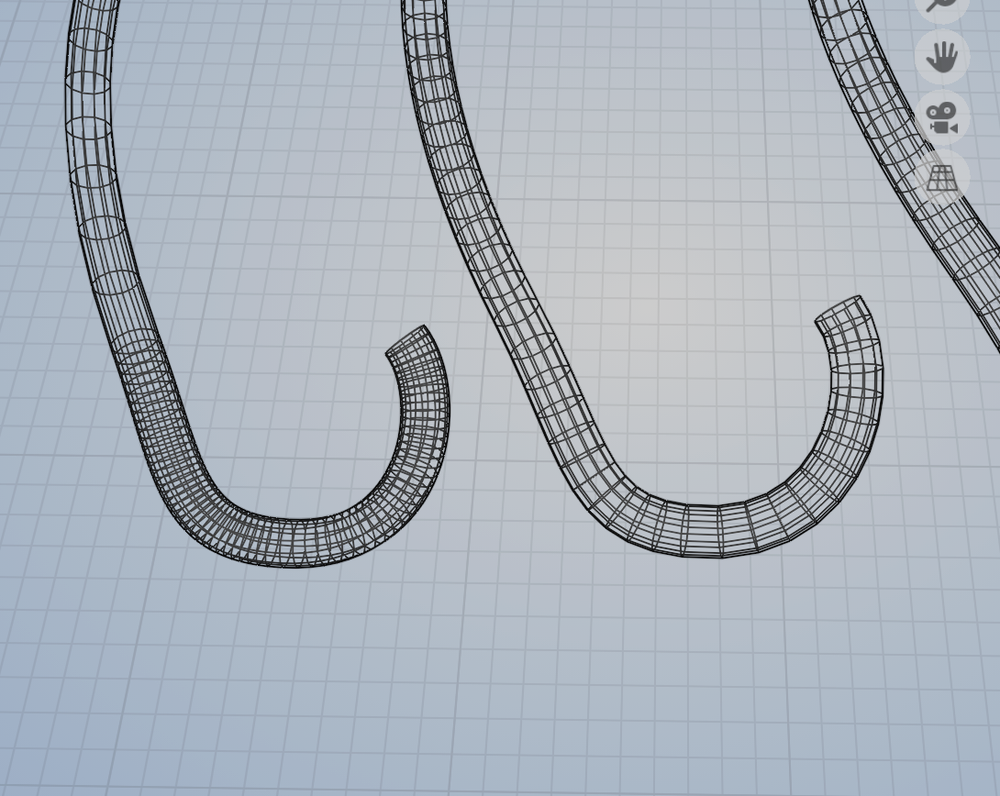
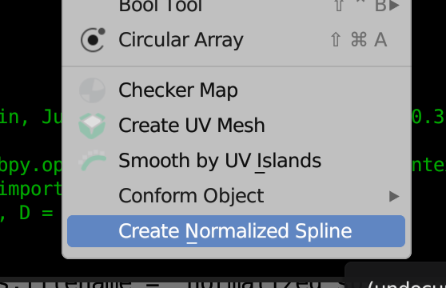
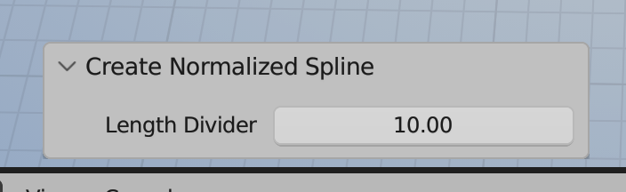

# Blender Normalize Spline

A simple clone of 3DSMax's 'Normalize Spline' feature. This addon is handy when you're trying map a texture through a spline. Like coursing energy through a tube, and things like that. By default, you will get non-linear motion, since your spline control points are probably all over the place, but divided evenly. So, things travel quickly through big spans, and slowly through jammed up ones. This fixes that. 

To use, install and enable the python file, select a spline at the object level, open the Object menu, and you should see 'Create Normalized Spline'. You can also search for the command. I'll try to get it added to a right click context menu if I get a chance.

The addon will create a copy of the spline in place, normalizing the points. You will get options for more divisions.
Lower numbers will get you more definition.

If you see below, the spline on the right has been 'normalized' so that it's evenly diced up. 

To use, just select your spline, go to the 'Object' menu in the viewport. You should have a this option below.

From there, you can play with how much you want your spline diced up. Like so...

Lower numbers give you more divisions. Salt to taste.

As a side note. I definitely used ChatGPT for this, and while it's both amazing and scary. I have to say that in this instance, there's NO WAY I could have written this addon. It would just not be worth the work for me. So, in that way, it's incredibly empowering.
